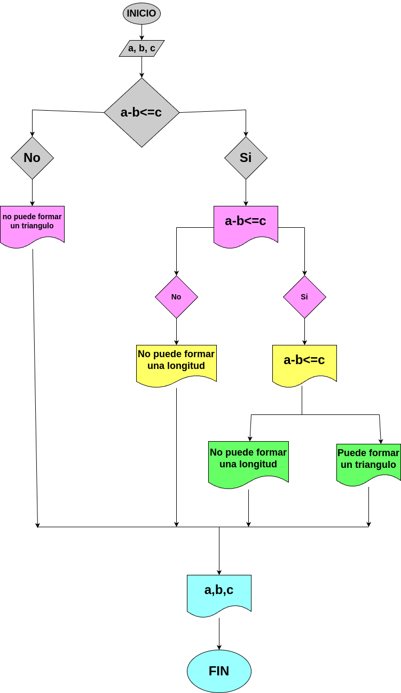

# Quiz_figura_geometrica

## Analisis:

Para determinar si tres longitudes (a, b, c) pueden formar un triángulo, se debe aplicar la desigualdad triangular:

* La suma de las longitudes de dos lados cualesquiera de un triángulo debe ser mayor que la longitud del tercer lado.

## DISEÑO

### Diagrama de flujo

# Construccion